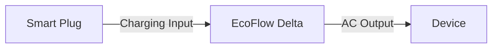
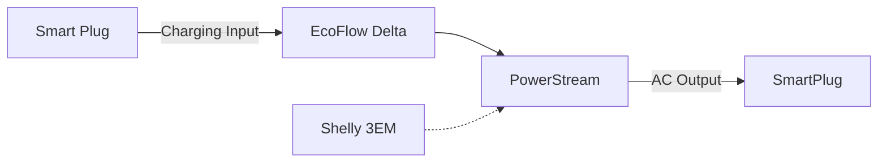

Lot’s of people have been buying portable battery systems, like those from EcoFlow or their competitors. These are really useful for taking power with you when your camping, or doing work away from the grid. But, they also often sit unused in the house for long periods. 

What if they could be used to save money on your energy bills or reduce your carbon emissions whilst unused at home?

The idea is simple, store energy in the battery when renewables are plentiful, and energy is cheap. And, use that stored energy to power your home, when you need them.

In this article, I will propose a number of ways you can achieve this. From using the battery to power a single device, to powering your whole home.

This technique can work with any portable batteries. But it most impactful when above 1 kWh or above. The EcoFlow Delta series is great, it ranges from 1-6 kWh (or even up to 25 kWh for the Pro model). Let’s use that as a starting example

## Powering a single device

The EcoFlow product range has AC outputs built in, which can cover almost any home appliance that you plug in to it. You can also plug in multiple AC devices. For example, if you have a desk with a monitor, laptop charger and a lamp, you can power all of these from one EcoFlow. This will typically be <1kWh of energy, can be easily powered all day from 1 charge.

The downside of this approach is maximising your use of the battery. For optimal savings, you want to use most of the capacity of the battery each day. You need to experiment, or do some maths, to work out which device makes the best use of the battery you have.

To make this work, you’ll need:
- An EcoFlow Battery
- A smart-plug to schedule charging

## Powering your full home

To power more than one device in your home, you can add a micro-inverter to your battery. EcoFlow's micro-inverter is called PowerFlow. With this, the battery can feed power to all your appliances via your home's existing wiring. This can be used to send power to your lights, TV, and partly power your Electric Hob and Oven. The maximum output of the PowerStream is 800W, but any power required by your home above this will be pulled from the grid, as before.

You’ll need:
- An EcoFlow Battery
- An EcoFlow PowerSteam Inverter
- A cable to connect the above two
- 2 x Smart Plugs to schedule charge and discharge times
- A Shelly 3EM to measure your consumption (or EcoFlow Smart Plugs)

## How much could I save?
Calculate the potential savings for yourself. The biggest factor in your potential savings is the energy tariff or rate plan. 

    

        

            <label for="model">EcoFlow Model:</label>
            <select id="model"></select>
        

        

            <label for="powerstream">PowerStream Installed:</label>
            <input type="checkbox" id="powerstream">
        

    

    

        

            <label for="capacity">Battery Capacity (kWh):</label>
            <input type="number" id="capacity" value="1" step="0.1">
        

    

    

        

            <label for="peakCost">Peak Energy Cost (£/kWh):</label>
            <input type="number" id="peakCost" value="0.35" step="0.01">
        

        

            <label for="offPeakCost">Off-Peak Energy Cost (£/kWh):</label>
            <input type="number" id="offPeakCost" value="0.15" step="0.01">
        

    

    

        Estimated Yearly Savings: £0
    

 

## Which smart plugs should I use?

All of these use-cases require a smart plug to schedule the charging, and discharging of the battery. This can be set on simple timers. If you know you are on an energy tariff which costs less overnight, you can program this into the timers.

But, if you want to maximise your carbon and costs savings, you’ll want to integrate more deeply with the grid and your energy supplier. [Windfall Energy](https://www.windfallenergy.com) plugs enable this. They will charge you battery when energy is greenest and cheapest, and divert the power back to your home at peak times.

